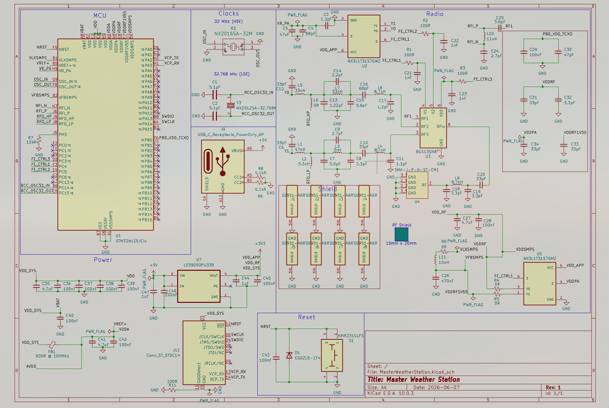
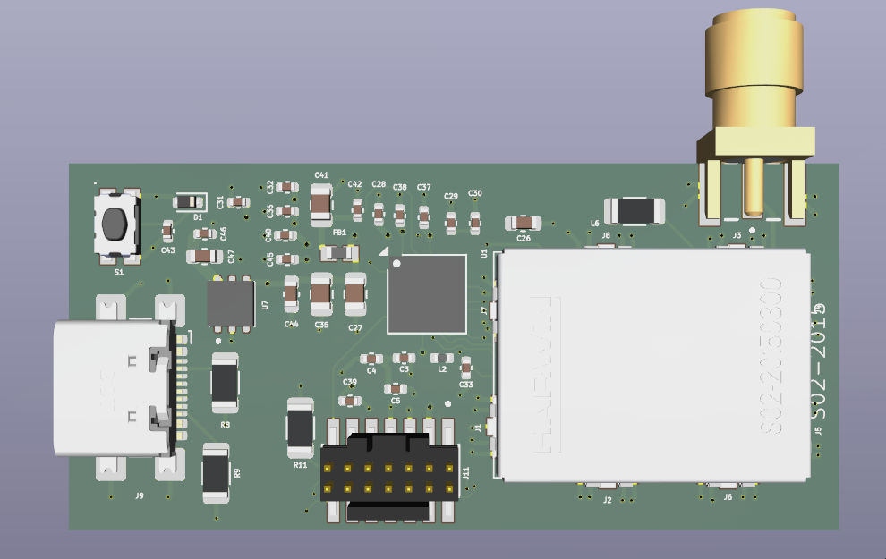

# Remote Weather Station

A wireless remote weather station system using STM32 boards, LoRa communication, a C-based local database, and a Node.js web dashboard.

## Overview

This project collects weather data from remote sensor boards and sends it wirelessly to a master receiver board using LoRa. The master board sends the data to a Linux server over UART/serial.

A C program reads the incoming data, stores it locally, and serves database requests over a socket connection. A Node.js server requests the latest or historical data from the C database server and displays it in a browser-based web dashboard.

## System Architecture

```text
Remote Sensor Boards
        |
        | LoRa
        v
Master Receiver Board
        |
        | UART / Serial
        v
C Database Server
        |
        | Local Socket
        v
Node.js Web Server
        |
        | HTTP
        v
Web Dashboard
```

## Features

- Wireless sensor data transfer using LoRa
- Temperature, pressure, and humidity readings
- STM32-based remote and master boards
- Local binary database written in C
- Circular storage per sensor node
- Socket connection between the C database and Node.js server
- Node.js web server for viewing sensor data
- Browser-based dashboard
- Can run headless on a Linux server or old PC

## Hardware

- STM32-based remote sensor boards
- STM32-based master receiver board
- LoRa radio modules
- Temperature, pressure, and humidity sensor
- Linux server or old PC for storage and web dashboard

## Sensor Data Collection

Each remote sensor board reads weather data from a BME280 sensor using SPI. The STM32 communicates with the BME280 by reading and writing the sensor’s registers over the SPI bus.

The BME280 provides raw temperature, pressure, and humidity values. These raw values are converted using the calibration values stored inside the sensor. After compensation, the remote board packages the final weather data into a struct and sends it wirelessly to the master receiver over LoRa.

Basic data flow:

```text
BME280 Sensor
     |
     | SPI
     v
STM32 Remote Sensor Board
     |
     | LoRa
     v
Master Receiver Board
```

The remote board uses SPI to:

- Configure the BME280 sensor
- Read calibration constants from the sensor
- Trigger or read measurement data
- Read raw temperature, pressure, and humidity registers
- Convert the raw readings into usable values

## PCB Schematic

Add schematic image here:



## PCB 3D Model

Add PCB 3D model render here:



## Project Structure

```text
Remote_Weather_Station/
├── Database/
│   ├── database.out
│   ├── Data/
│   ├── Inc/
│   └── Src/
├── Master_Remote_Station/
├── Servant_Remote_Station/
├── Web_View/
│   ├── server.js
│   ├── dbClient.js
│   └── public/
├── makefile
├── package.json
└── README.md
```

## Database Server

The database server is written in C. It reads weather data from the master receiver over UART/serial and stores the data in local binary files.

Each sensor node has its own circular storage area. When the storage reaches the maximum number of records, it wraps around and overwrites the oldest data.

The database server also listens for socket commands from the Node.js server.

Example commands supported by the database server:

```text
READ_LAST <nodeID>
READ_ALL <nodeID>
READ_N <nodeID> <n>
```

Example JSON response:

```json
{
  "ok": true,
  "recordsRead": 1,
  "data": [
    {
      "temperature": 25,
      "pressure": 101325,
      "humidity": 50,
      "timeStamp": 123456
    }
  ]
}
```

## Running the Database Server

Example:

```bash
cd Database
./database.out -B 12 33554432
```

Arguments:

```text
-B              size mode
12              number of sensor nodes
33554432        page size in bytes
```

## Web Server

The web server is written in Node.js using Express. It serves the web dashboard and provides API routes for the frontend.

Example API routes:

```text
/api/sensor/0/latest
/api/sensor/0/all
/api/sensor/0/last/10
```

The Node.js server talks to the C database server over a local socket connection.

## Running the Web Server

```bash
cd Web_View
node server.js
```

Then open the dashboard from another computer:

```text
http://SERVER_IP:3030
```

Example:

```text
http://10.0.0.55:3030
```

## Running as systemd Services

The project can be run in the background using systemd services.

Start the database service:

```bash
sudo systemctl start weather-database
```

Start the web server service:

```bash
sudo systemctl start weather-web
```

Check status:

```bash
systemctl status weather-database
systemctl status weather-web
```

View logs:

```bash
journalctl -u weather-database -f
journalctl -u weather-web -f
```

Restart services:

```bash
sudo systemctl restart weather-database
sudo systemctl restart weather-web
```

## Network Access

The Node.js server should listen on all interfaces:

```js
app.listen(3030, "0.0.0.0", () => {
  console.log("Web server listening on port 3030");
});
```

Then the dashboard can be opened from another computer on the same network:

```text
http://SERVER_IP:3030
```

## Notes

This project is designed as a learning-focused embedded systems project. It combines embedded firmware, wireless communication, serial communication, local database design, socket programming, Linux services, and web development.

## Future Improvements

- Add sensor node selection in the web dashboard
- Add CSV export
- Add better error handling for disconnected sensors
